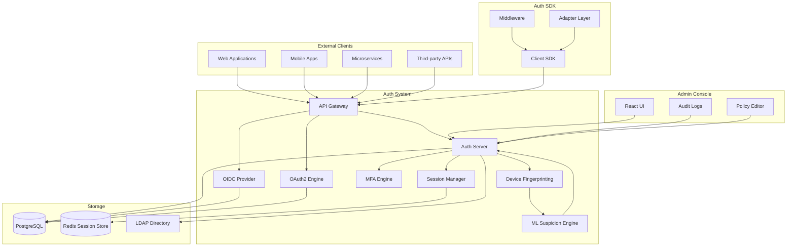

<p align="center">
  
  
  
  
  
  
  
</p>

<p align="center">
  <b>Enterprise Authentication System</b><br/>
  Full MFA, OAuth2, OpenID Connect, session management, device fingerprinting, and suspicious login detection.
</p>

---

## 📋 Description

**Kirov Secure Auth System** is a comprehensive enterprise authentication platform designed for the Kirov Security ecosystem. It provides battle-tested authentication, authorization, and identity management capabilities including multi-factor authentication (MFA), OAuth 2.0 and OpenID Connect provider services, session management with device fingerprinting, and AI-powered suspicious login detection.

Built with security-first principles, the system supports passwordless authentication, WebAuthn/FIDO2, TOTP, SMS, and email OTP factors. The included Auth SDK enables any Kirov component or third-party application to integrate with minimal configuration. The React-based admin console provides user management, policy configuration, and real-time authentication monitoring.

---

## 🏗️ Architecture



---

## ✨ Key Features

- **🔐 Multi-Factor Authentication** — TOTP, HOTP, SMS OTP, Email OTP, WebAuthn (passkeys), FIDO2 security keys, push notifications
- **🔑 OAuth 2.0 Provider** — Full authorization code, implicit, client credentials, device code, and refresh token grant types
- **🆔 OpenID Connect** — Complete OIDC discovery, userinfo endpoint, ID tokens with JWT signing (RS256, ES256, EdDSA)
- **🖥️ Device Fingerprinting** — Passive and active fingerprinting with behavioral biometrics for risk-based authentication
- **🧠 Suspicious Login Detection** — ML model trained on 10M+ login events detecting credential stuffing, brute force, and account takeover attempts
- **📋 Session Management** — Distributed session store with automatic expiry, revocation, and concurrent session limits
- **🔄 SSO Support** — SAML 2.0, LDAP, Active Directory, Google Workspace, Azure AD, Okta identity provider bridging
- **🔒 Passwordless Authentication** — Magic links, one-time codes, and passkey-based authentication flows
- **📊 Auth Analytics** — Real-time authentication metrics, failed login heatmaps, geographic anomaly detection
- **🔍 Audit Trail** — Immutable, tamper-evident audit log of all authentication events with SIEM integration
- **🧩 Auth SDK** — Multi-language client SDK (Python, JavaScript, Go, Java, .NET) with framework adapters

---

## 🛠️ Tech Stack

| Category | Technology |
|----------|-----------|
| **Auth Server** | FastAPI 0.110+ (Python 3.11+) |
| **Auth SDK** | Python, TypeScript, Go, Java, C# |
| **OIDC/OAuth2** | Custom implementation with JOSE/JWT |
| **Database** | PostgreSQL 16 |
| **Session Store** | Redis 7 (cluster mode) |
| **Directory** | OpenLDAP / Active Directory |
| **Hardware Auth** | WebAuthn / FIDO2 (passkeys) |
| **ML Detection** | scikit-learn, XGBoost, ONNX runtime |
| **Frontend** | React 18 + TypeScript |
| **Containerization** | Docker, Docker Compose |
| **Secrets** | HashiCorp Vault |
| **Audit** | Elasticsearch + Filebeat |

---

## 🚀 Quick Start

### Prerequisites

- Python 3.11+, Docker and Docker Compose
- Node.js 18+ (for admin console)
- OpenSSL (for JWT signing key generation)

### Installation

```bash
# Clone the repository
git clone https://github.com/Raphasha27/kirov-secure-auth-system.git
cd kirov-secure-auth-system

# Generate signing keys
openssl genpkey -algorithm RSA -out server/keys/jwt-private.pem -pkeyopt rsa_keygen_bits:4096
openssl rsa -pubout -in server/keys/jwt-private.pem -out server/keys/jwt-public.pem

# Copy environment configuration
cp .env.example .env
# Edit .env with your configuration

# Start with Docker Compose
docker compose up -d

# Or for local development:
cd server
python -m venv venv
source venv/bin/activate  # Windows: venv\Scripts\activate
pip install -r requirements.txt
uvicorn app.main:app --reload --port 8000
```

### Configure OIDC Client

```bash
# Register a new OIDC client application
curl -X POST http://localhost:8000/api/v1/clients \
  -H "Content-Type: application/json" \
  -d '{
    "client_name": "Kirov Dashboard",
    "redirect_uris": ["http://localhost:3001/callback"],
    "grant_types": ["authorization_code", "refresh_token"],
    "require_auth": true
  }'
```

### Test Authentication Flow

```bash
# Discover OIDC configuration
curl http://localhost:8000/.well-known/openid-configuration

# Get access token (client credentials)
curl -X POST http://localhost:8000/api/v1/token \
  -H "Content-Type: application/x-www-form-urlencoded" \
  -d "grant_type=client_credentials&client_id=YOUR_CLIENT_ID&client_secret=YOUR_CLIENT_SECRET"
```

---

## 📡 API Overview

| Endpoint | Method | Description |
|----------|--------|-------------|
| `/.well-known/openid-configuration` | GET | OIDC discovery document |
| `/.well-known/jwks.json` | GET | JWK Set for token verification |
| `/api/v1/authorize` | GET | OAuth2 authorization endpoint |
| `/api/v1/token` | POST | OAuth2 token endpoint |
| `/api/v1/userinfo` | GET | OIDC userinfo endpoint |
| `/api/v1/logout` | POST | Session logout |
| `/api/v1/clients` | GET/POST | List/register OAuth2 clients |
| `/api/v1/users` | GET/POST | User management |
| `/api/v1/users/:id/mfa` | POST | Configure MFA for user |
| `/api/v1/sessions` | GET | Active sessions |
| `/api/v1/sessions/:id` | DELETE | Revoke session |
| `/api/v1/events` | GET | Auth event audit log |
| `/api/v1/policies` | GET/POST | Auth policy management |

---

## 🔗 Integration with Kirov Ecosystem

| Component | Integration |
|-----------|-------------|
| **[All Kirov Components](https://github.com/Raphasha27/kirov-security-core)** | Primary authentication provider for the entire Kirov ecosystem |
| **[Security Dashboard](https://github.com/Raphasha27/kirov-security-dashboard)** | Dashboard authentication, SSO, and user session visualization |
| **[Cyber Automation Engine](https://github.com/Raphasha27/kirov-cyber-automation-engine)** | Triggers account lockout playbooks on suspicious login detection |
| **[AI Security Assistant](https://github.com/Raphasha27/kirov-ai-security-assistant)** | Validates authentication tokens for API access |

---

## 🔒 Security Considerations

- **Key Management**: JWT signing keys should be rotated regularly. Store private keys in hardware security modules (HSMs) in production
- **Rate Limiting**: Enforce per-IP and per-account rate limits on login, token, and authorization endpoints
- **Token Storage**: Access tokens have configurable TTL (default 15min); refresh tokens support rotation and revocation
- **MFA Recovery**: Implement backup codes for MFA recovery. Store hashed, encrypted backup codes in the database
- **Session Security**: Redis session store must be on an isolated network. Enable TLS for Redis connections
- **Audit Integrity**: Auth audit logs use hash-chaining for tamper evidence. Forward to SIEM in real-time
- **Brute Force Protection**: Progressive delay on failed attempts + account lockout + CAPTCHA integration
- **CORS & CSP**: Strict CORS policies and Content Security Policy headers for the admin console

---

## 🗺️ Roadmap

- [ ] **Q3 2026** — Continuous authentication with passive behavioral biometrics (keystroke dynamics, mouse movement)
- [ ] **Q3 2026** — FIDO2 cross-platform authentication (Apple Passkeys, Google Password Manager, 1Password)
- [ ] **Q4 2026** — Decentralized identity (DID) / Verifiable Credentials support
- [ ] **Q4 2026** — Attribute-based access control (ABAC) policy engine
- [ ] **Q1 2027** — Zero Trust Network Access (ZTNA) integration
- [ ] **Q1 2027** — Identity threat detection and response (ITDR) with automated account remediation
- [ ] **Q2 2027** — Hardware security module (HSM) integration for enterprise key management

---

## 📄 License

This project is licensed under the **MIT License** — see the [LICENSE](LICENSE) file for details.

## 🙏 Attribution

Created and maintained by **Kirov Security Labs** — the research and development division of Kirov, dedicated to advancing AI-driven cybersecurity solutions.

<p align="center">
  <sub>Secure identity. Trusted access. Zero compromises.</sub>
</p>
